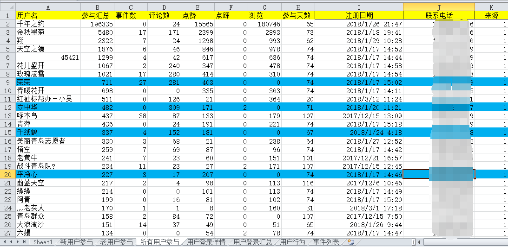

# # 一级标题
## ## 二级标题
### ### 三级标题
#### #### 四级标题
##### ##### 五级标题
###### ###### 六级标题
- 列表-
---
---分割线
1. 撒地方
2. 链接[链接](https://www.baidu.com)
>‘>’这是引用的前缀

*斜体前后*  **粗体**
#### 代码引用
`Hello World`
```
public ChaosGestureView(Context context) {
      this(context,null);
}
```
dog|cat|tiger
-|-|-
1|2|3
4|5|6

## 发现bug
  为运营导用户行为数据时，发现部分用户数据异常，停留在某一时间点，该时间点之后的行为数据都没有收集到，就问你神不神奇
  


