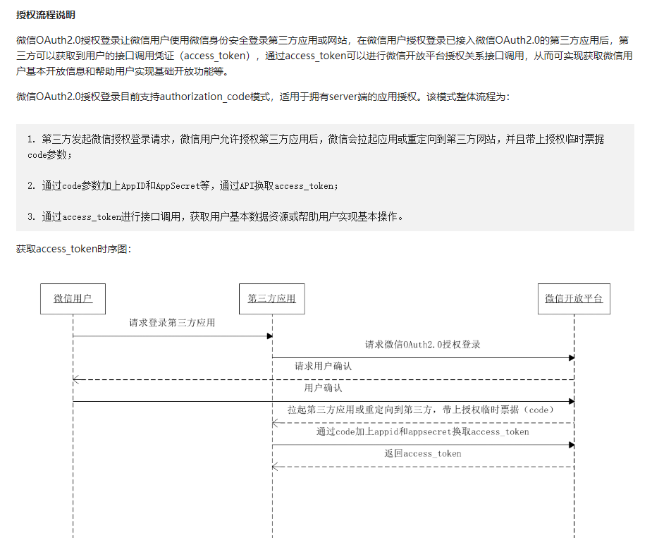
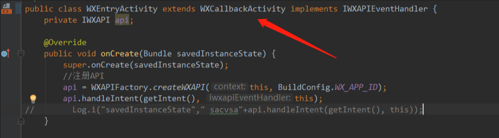
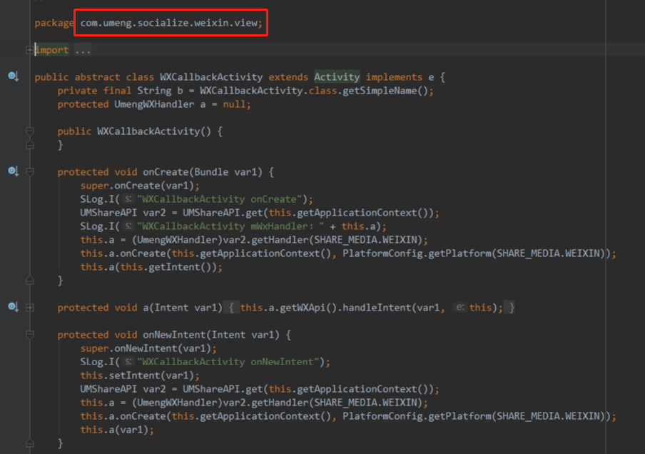

## App微信授权
### 流程
原生应用通过调用微信SDK的api换取用于获取微信token的code参数，算了，还是直接上微信开放平台的文档吧

然后我们这边除了获取code的步骤，其他的都由后台来处理,后台通过code来调获取token的接口，获取到token后，再去调用获取微信用户信息的接口，然后把微信用户信息存数据库，做自己的业务，最后返回给前端结果。

### bug1 授权失败

由于我们的appId 包名都换过了，微信的appId/secret 都做了更改，而根据code获取token的接口需要对appId和secret，后台的wechat配置和前端的暗号没对上，所以导致了授权失败

### bug2 授权时而成功，时而失败，Android/iOS都会出现

微信的机制是code使用一次之后就失效了，授权失败时错误码是40163（code been used），而我们前端每次都是获取新的code给后端，然后就把锅给了后端，后端通过日志也确定了我们发的code都是新的，然后考虑是不是缓存啊，是不是集群的原因啦等等等，然后一个个排查，把服务器搞成单机，都避免不了概率性失败的事实。

CTO偶然间发现他的每次授权都成功，因为他的手机连着代理，连代理就每次都成功，不连就概率性失败，这TM到底是什么鬼？？？

这时，牛大说会不会是umeng的事，牛大在我们扯皮的时候一直在查找原因，问了下iOS的也集成了umeng，牛大发现微信回调的页面继承了一个伪装成wechat的umeng的Actvity,WTF 这是什么操作……

然后这个WXCallbackActivity来自umeng

不继承umeng的那个Activity，就不会出现code被使用的错误，果然是umeng把我们从微信辛辛苦苦获取的code给偷偷消费了，谁的网速快谁先把这个code消费掉，最后得出的结论是：
    **第三方的聚合平台不靠谱啊**

其实，我们的项目集成了umeng第三方分享默认是有登录的功能的，但是在登录的时候没有用umeng的登录，而是直接用的微信sdk登录的，所以会出现双方抢code拼网速来消费导致概率性授权失败的情况
 
